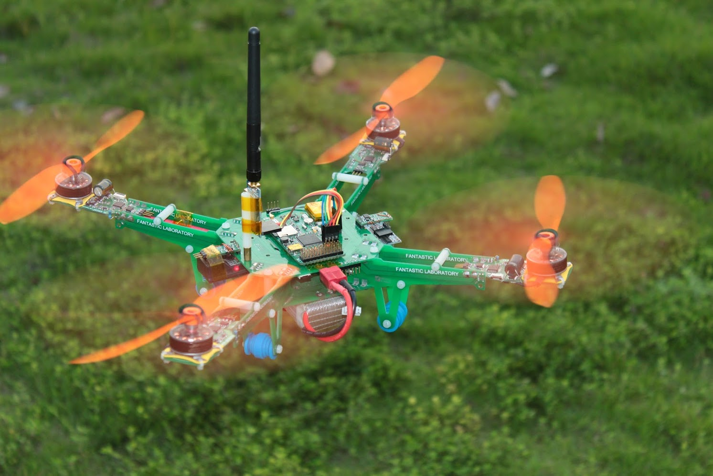

# DeepBlue PCB 四轴飞行器

*这个仓库只当做存档，代码和PCB已经比较老，不再维护*

**请尊重作者的版权信息。仓库内所有文件非授权情况下请勿转载。**

联系作者：majianjia@live.com

### 一些背景：

我叫麻建嘉，于2014年毕业于桂林电子科技大学机电工程学院，这个DeepBlue飞行器是作为我的本科毕设制作的。[论文](四轴飞行器的控制-毕业论文-麻建嘉.pdf)和[答辩PPT](四轴飞行器的控制-毕设答辩.pptx) 可以在这个仓库内找到。这个飞行器获得了优秀毕业设计奖。毕业后我就出国留学了，现在在南安普顿大学做博后。不过依然很喜欢飞控和相关的算法。

当时我本科毕业后，就把源代码上传到了几个航模和电子论坛，不是很方便维护和检索。

现在汇总一下，发在GitHub上，方便感兴趣的小伙伴下载参考。 

### 关于毕设

虽然我的毕设题目是：《四轴飞行器的控制》，但飞行器的算法都是用最基本的算法，更复杂的是如何协调好各个任务。

而让我自己感到更加有价值的部分是如何在 RTT 上运行一个飞控并较好的协调各个模块的工。希望能给学习 STM32 和 RT-Thread 的同学一个参考，也希望 RTT 能越做越好。

四轴断断续续做了5个月，因为这几年都做类似的东西，所以做起来难度不大，我的目标是够用就行。而对于飞控，是我一直从大一到大四的学习研究过程，持续做了四年。

**四轴飞行器的主要参数如下：**

| 参数                      |             |
| ------------------------- | ----------- |
| 空机重量                  | 390g        |
| 起飞重量（11.1V 2200mAh） | 550g        |
| 续航时间                  | 20分钟      |
| 载重能力                  | 200g        |
| 悬停力效率                | >10g/w      |
| 电机                      | 2206 kv1200 |
| 桨                        | 8043        |
| 单个电机最大推力          | 290g        |

| 传感器   | 型号     |
| -------- | -------- |
| 陀螺仪   | MAX21000 |
| 加速度计 | ADXL362  |
| 磁阻     | HMC5983  |
| 气压计   | MS5611   |

传感器全部使用 SPI 接口，软件利用 RTT 的 SPI 驱动，所以 ODR (Output Data Rate) 非常高。

| 参数           | 值      |
| -------------- | ------- |
| 陀螺仪ODR      | 2kHz    |
| 姿态解算更新率 | 1kHz    |
| 控制更新率     | 1kHz    |
| 电调控制更新率 | 1kHz    |
| CPU 占用率     | 50~70%* |

*：取决于是否需要高速记录 log 到 SD 卡。

全机一共9个微控制器，主控芯片为 1 个 STM32F4，其他的为 STM32F1 （电调，电源管理，传感器终端，接收机 PPM 解码器等等），全部运行RTT，全部使用CAN BUS 通信。

飞控本身集成度较高（集成 10轴传感器，GPS，12路PWM输出，1路 PPM 输入，1路  UART，1路CANbus），在没有其他模块的情况下也可以单独完成飞行任务。拓展模块包括电源板，电调板，各个传感器，PWM解码模块等，因为有了CAN Bus，使用很方便，论文内有详细说明。

电调为自制兼容 ESC32的 硬件（感谢开源模型兴趣组的群主提供了 ESC32 的原理图）

软件上在 ESC32 与硬件之间加入 RTT 层，劫持了PWM更新函数，从而实现控制数据流使用双向的
`飞控 <-> CANBUS <-> RTT <-> ESC32 `
代替了传统单向的 
`飞控 -> PWM -> ESC32`
数据沟通速度大幅度提高，信号延迟降低非常多（50Hz 对比 1000Hz），提供了反馈的能力。

论文里面提到几个新的思路，包括虚拟终端，大的PCB机架+电路，单总线在四轴上的应用，都是我在以前的制作中，感觉非常不方便后，提出的解决方案，在实际中也帮我省了很多精力去调试。

我在博客上也写了一些飞控系列文章：

[与飞控无关 - 在飞控中记录路径（KML）文件，并在谷歌地球上显示](http://aircheese.me/2016/kml-path.html)

[与飞控无关 - 记刚开始弄飞控那会儿（上）](http://aircheese.me/2016/first-day-of-uav1.html)

[与飞控无关 - 记刚开始弄飞控那会儿（下）](http://aircheese.me/2016/first-day-of-uav2.html)

制作全过程视频

https://www.bilibili.com/video/BV1tL4y1H7Sf

